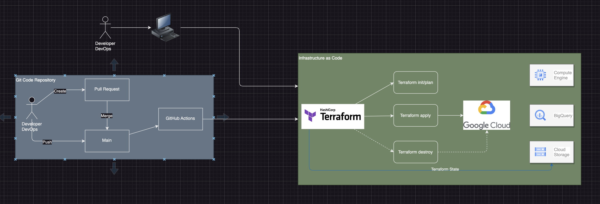

# Terraform Templates for GCP Hanalytics Project

### Overview

### Deployment model

### GitHub Action (coming...)

### Commands
In the appropriate folder : 
- terraform init
La première commande à lancer pour une nouvelle configuration qui va initialiser la configuration
locale (import de modules par exemple).
La commande terraform init va automatiquement télécharger et installer les binaires des
providers nécessaires.
- terraform plan
La commande terraform plan permet d’afficher le plan d’exécution, qui décrit quelles actions
Terraform va prendre pour effectuer les changements réels de l’infrastructure.
Si une valeur est affichée comme computed, cela veut dire que cette valeur ne sera connue qu’au
moment de l’exécution du plan.
- terraform apply
La commande terraform apply va réellement appliquer les changements tels qu’ils ont été décrits
par la commande terraform plan.
- terraform show
La commande terraform show permet d’afficher l’état courant de l’infrastructure.
Une fois que l’infrastructure est gérée via Terraform, il est préférable d’éviter de la modifier manuellement.
Terraform va inscrire des données importantes dans un fichier terraform.tfstate. Ce fichier va
stocker les ID des ressources créées de façon à savoir quelles ressources sont gérées par Terraform,
et lesquelles ne le sont pas. Ce fichier doit donc à son tour être conservé et partagé avec toutes les
personnes devant intervenir sur la configuration.
    -  Ce fichier terraform.tfstate contient des données sensibles. Il doit donc être partagé mais de manière sécurisée (des modules existent), éventuellement ailleurs que dans le repo du code de l’infrastructure.
    - Des ressources déjà existantes peuvent être importées avec la commande terraform import ressourcetype.name id_existant.
- terraform destroy
Avec l’avènement du cloud, le cycle de vie d’un serveur et notre façon de consommer les ressources
ont considérablement changé. Une VM ou une infrastructure doit tout aussi facilement pouvoir être
créée que supprimée.
Avec Terraform, une infrastructure complète peut être déployée juste à l’occasion des tests de non
régréssion lors de la création d’une nouvelle version logicielle par exemple et être totalement
détruite à la fin de ceux-ci pour réduire les coûts d’infrastructure au plus juste.
La commande terraform destroy est similaire à la commande terraform apply

### Resources

- https://registry.terraform.io/providers/hashicorp/google/5.7.0/docs/guides/getting_started

- https://cloud.google.com/docs/terraform?hl=fr#docs

- https://developer.hashicorp.com/terraform/intro