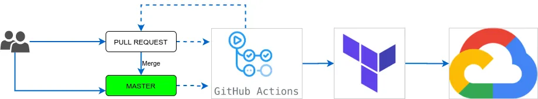

# Terraform Templates for GCP Hanalytics Project

### Overview

### Deployment model

### GitHub Action

### Commands
In the appropriate folder : 
- terraform init
- terraform plan
- terraform apply
- terraform destroy 

### Resources

- https://registry.terraform.io/providers/hashicorp/google/5.7.0/docs/guides/getting_started

- https://cloud.google.com/docs/terraform?hl=fr#docs